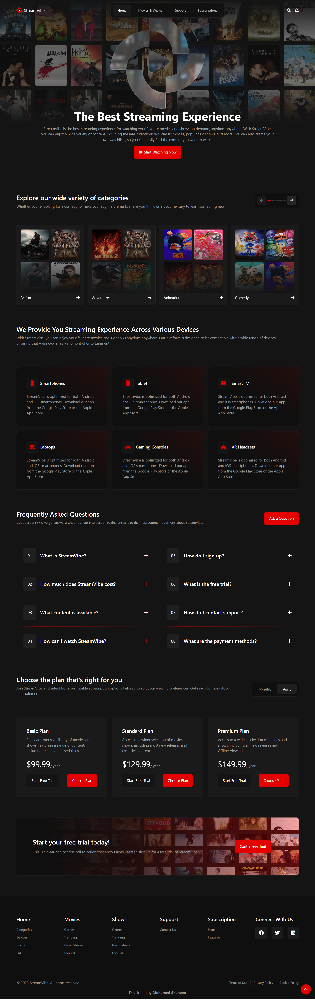

# StreamVibe

StreamVibe is your ultimate destination for discovering movies and TV shows. Built with React and powered by the TMDb API, it offers a sleek, user-friendly interface to explore trending content, detailed movie information, and personalized recommendations. Users can easily navigate through genres, watch trailers, and keep track of their favorite films. With real-time updates, responsive design, and interactive features, StreamVibe provides a seamless and engaging experience for movie enthusiasts.

## Features

- **Responsive Design**: Fully optimized for all screen sizes.
- **React Components**: Reusable and modular components for easy updates and maintenance.
- **User-friendly Navigation**: Easy-to-navigate sidebar and top navigation bar.
- **Interactive Elements**: Subtle animations and JavaScript functionality to enhance the user experience.
- **TMDb API Integration**: Fetch and display movie and TV show data seamlessly.
- **React Router**: Seamless navigation between pages.
- **React Toastify**: Real-time notifications for better user interaction.
- **React Content Loader**: Smooth loading animations for a better user experience.
- **React Hook Form**: Simplified forms with validation.
- **React Loader Spinner**: Enhanced loading visuals.
- **React Phone Number Input**: User-friendly phone number input fields.
- **Swiper and React Slick**: Smooth carousels and sliders.

## Technologies Used

- **HTML**: For structuring the content of the page.
- **CSS**: To style and layout the design.
- **Bootstrap**: For responsive and modern design.
- **Font Awesome**: For professional-grade icons.
- **React**: A JavaScript library for building user interfaces.
- **Vite**: A fast build tool for development and production.
- **Yup**: Schema validation for forms.
- **Axios**: For API calls and data fetching.
- **TMDb API**: To integrate movie and TV show data.

## Screenshots

